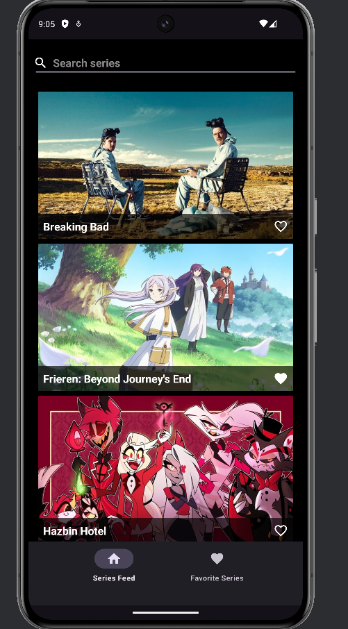
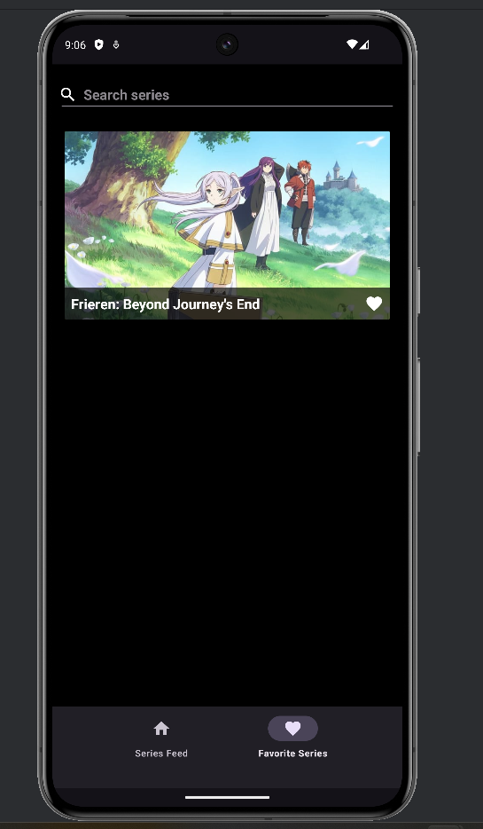
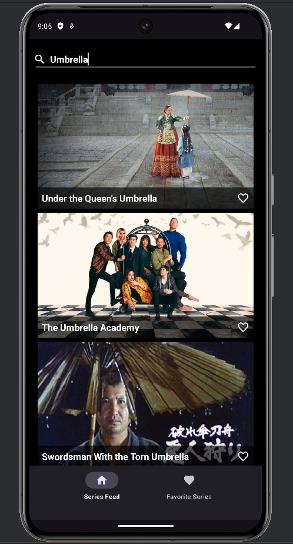

# Series Explorer App

Welcome to the **Series Explorer App**, an Android application built with Kotlin and Android Studio. This app allows users to browse popular TV series, view details of each series, and explore other information such as release dates, languages, and overviews using the [TMDB API](https://developers.themoviedb.org/3/getting-started/introduction).

## Features

- Browse a list of popular TV series fetched from the internet using TMDB API.
  
 - **Favorite Series**: Users can save their favorite series by clicking on the heart icons at the bottom of each series. These favorites can later be accessed through the bottom navigation menu.
     

- **Search Series**: Users can search for a TV series using the search bar and view the results in real-time.
     
- **Series Detail**: Clicking on a series will show the details of that series.
     
